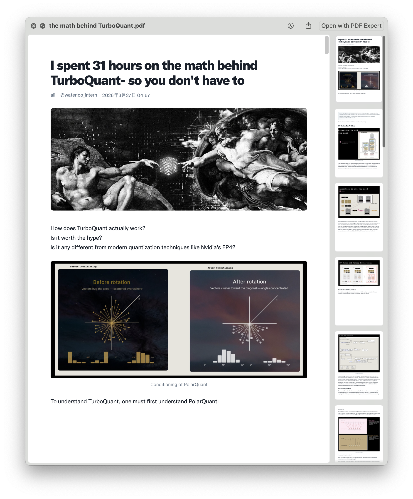
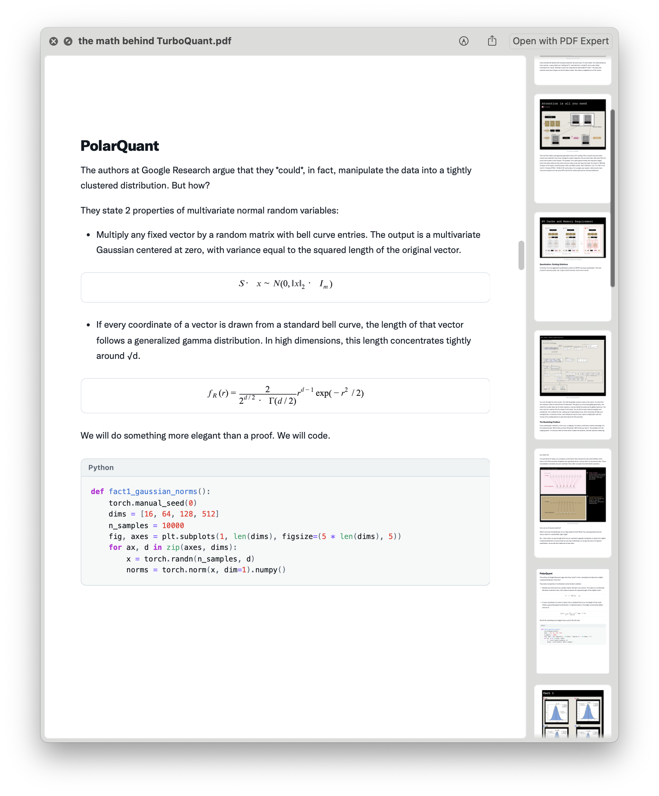
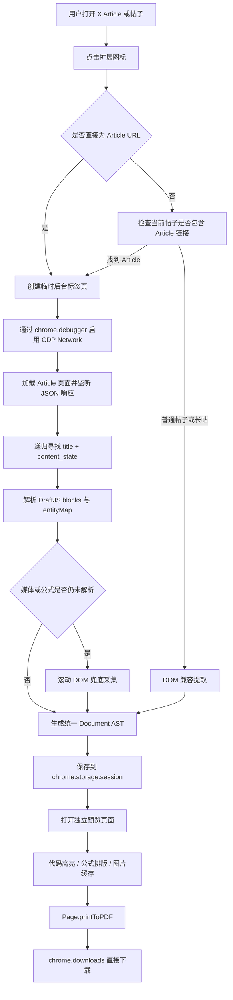

# X 长文导出 PDF


一个面向 **X Articles、长帖与普通帖子** 的 Chrome / Edge 扩展。

它不是简单截图，也不是把 X 页面原样交给浏览器打印，而是优先读取 X 页面已经取得的结构化 Article 数据，重建标题、段落、标题层级、列表、引用、代码、公式和媒体，再生成可编辑预览与高质量 PDF。

> 本项目与 X Corp. 无隶属、合作或背书关系。导出内容的版权与使用权限由原作者、内容许可及适用法律决定。

---

## 目录

- [主要特性](#主要特性)
- [支持范围](#支持范围)
- [效果与设计目标](#效果与设计目标)
- [工作原理](#工作原理)
- [为什么导出时会看到页面自动滚动](#为什么导出时会看到页面自动滚动)
- [安装](#安装)
- [使用方法](#使用方法)
- [预览与导出选项](#预览与导出选项)
- [代码支持](#代码支持)
- [公式支持](#公式支持)
- [PDF 生成流程](#pdf-生成流程)
- [权限与隐私](#权限与隐私)
- [项目结构](#项目结构)
- [本地开发](#本地开发)
- [测试](#测试)
- [诊断与问题反馈](#诊断与问题反馈)
- [已知限制](#已知限制)
- [路线图](#路线图)
- [贡献](#贡献)
- [常见问题](#常见问题)
- [第三方组件](#第三方组件)
- [许可证](#许可证)

---

## 主要特性

### 结构化提取

- 优先捕获 X 页面已经请求的 Article JSON，而不是仅依赖易变的 DOM 选择器。
- 从 DraftJS `content_state.blocks` 和 `entityMap` 恢复文章原始顺序。
- 标题优先使用结构化数据中的 `article.title`，避免把正文第一个章节标题误判为文章标题。
- DOM 只作为普通帖子、长帖及缺失媒体或公式时的兼容兜底。

### 富文本支持

- 文章标题和多级正文标题
- 普通段落
- 粗体、斜体、下划线、删除线
- 行内代码
- 上标和下标
- 有序列表、无序列表及嵌套列表
- 引用块
- 分隔线
- 表格
- 链接卡片
- 嵌入帖子
- 图片、视频封面和 GIF 封面

### 代码支持

- 从 X Article 的 Markdown entity 恢复真实代码文本。
- 保留换行、缩进、注释和特殊字符。
- 本地 PrismJS 语法高亮，不依赖第三方 CDN。
- 每个代码块提供一键复制按钮。
- PDF 中仍然保留可选择、可复制的代码文本。

### 公式支持

- 识别 X DraftJS 中的 `LATEX`、`TEX`、`MATH` 和 `EQUATION` entity。
- 支持通过 `entityKey` 从已捕获响应中反查公式源。
- 后端公式源不完整时，从 X 当前页面的 MathML、MathJax、KaTeX 或可访问性属性中补取。
- 默认使用 Chromium 原生 MathML，公式在预览与 PDF 中可选择、可搜索。
- 复杂公式无法使用原生 MathML 时，单公式降级为 SVG。
- 每个 LaTeX 公式提供“复制 LaTeX”按钮。

### PDF 导出

- 一键直接下载 PDF，不打开系统打印窗口。
- A4 和 Letter 页面尺寸。
- 打印背景、代码高亮、图片、公式和链接。
- 启用 tagged PDF 与文档 outline。
- 图片在导出前缓存，降低打印瞬间网络失败造成的缺图风险。

### 排版选项

- X 原生 Chirp 风格
- 衬线阅读风格
- 系统无衬线风格
- 三档正文字号
- 四种代码主题
- 图片、嵌入内容、来源开关
- 代码换行开关
- 设置自动保存在浏览器本地

---

## 支持范围

| 内容类型 | 示例路径 | 处理方式 | 当前状态 |
|---|---|---|---|
| X Article | `x.com/user/article/123...` | 捕获 Article JSON，解析 DraftJS | 主要支持目标 |
| 包含 Article 的帖子 | `x.com/user/status/123...` | 先识别 Article 链接，再提取 Article | 支持 |
| Longer Post / 长帖 | `x.com/user/status/123...` | DOM 与页面文本兼容提取 | 支持，准确度取决于页面结构 |
| 普通帖子 | `x.com/user/status/123...` | DOM 提取 | 支持 |
| 嵌套列表 | Article DraftJS blocks | 按 `depth` 重建 | 支持 |
| Markdown 代码 | Article atomic entity | 转换为结构化 code block | 支持 |
| LaTeX 公式 | Article LATEX entity | 原生 MathML，SVG 兜底 | 支持 |
| 图片 | Article media entity / DOM | 原始顺序插入并缓存 | 支持 |
| 视频、GIF | 媒体 entity | 导出封面和原始链接 | 部分支持 |
| 投票、链接卡片、嵌入帖子 | entity / 页面数据 | 结构化卡片 | 视 X 返回数据而定 |
| 私密、删除或无权访问内容 | 任意 | 仅能处理当前账号可访问内容 | 不绕过访问控制 |

---

## 效果与设计目标

项目重点不是像素级复刻 X 页面，而是生成适合保存、阅读和研究的文档：

- 正文层级明确；
- 代码可复制且有语法高亮；
- 公式尽量可选择和搜索；
- 图片清晰且按文章顺序出现；
- 不混入侧栏、互动按钮、推荐内容和浏览器页眉页脚；
- 不要求用户把 Cookie 或登录令牌交给第三方服务器。





---

## 工作原理



### 1. Article 数据捕获

扩展在临时标签页导航到 Article 页面前，通过 Chrome DevTools Protocol 开启 Network 域。页面加载时，扩展读取当前页面已经收到的 JSON 响应，并递归寻找同时包含以下结构的候选对象：

```text
title
content_state.blocks
content_state.entityMap 或 content_state.entities
```

这一策略不依赖固定 GraphQL operation 名称或 hash，因此比硬编码某个 X API URL 更耐页面更新。

### 2. DraftJS 解析

解析器会把 X Article 的 DraftJS 内容转换成项目内部的统一文档块：

```text
paragraph
heading
blockquote
list
code
formula
image
media
embedded_post
link_card
table
separator
```

PDF 渲染层只认识统一文档块，不直接依赖 X 页面 DOM。

### 3. 兼容兜底

若结构化数据缺少公式源或媒体 URL，扩展才会滚动文章页面，补充采集当前实际渲染出来的内容。

### 4. 预览与导出

统一文档数据通过 `chrome.storage.session` 传递给预览页。预览页完成代码高亮、公式渲染、字体选择和图片本地化后，调用 `Page.printToPDF` 生成 PDF。

---

## 为什么导出时会看到页面自动滚动

X 会对长文章使用懒加载和虚拟化：

- 图片滚动到附近后才加载；
- 公式可能由独立前端组件延迟渲染；
- 离开视口较远的媒体节点可能被 React 卸载；
- 首轮加载图片后，文章总高度还会继续变化。

当结构化 Article 数据中仍存在未解析的公式或媒体时，扩展会执行滚动兜底采集。当前实现最多进行三轮扫描，并在页面高度和采集结果稳定后提前停止。

滚动过程只用于读取页面内容，不会：

- 点赞；
- 转发；
- 回复；
- 关注账号；
- 修改帖子；
- 向 X 发送发布操作。

普通 Article 如果结构化数据已完整取得，通常不需要完整滚动采集。

---

## 安装

### 从 GitHub 源码安装

1. 下载仓库 ZIP，或克隆仓库：

   ```bash
   git clone https://github.com/<your-name>/<your-repository>.git
   ```

2. 打开 Chrome 或 Edge 扩展管理页：

   ```text
   chrome://extensions/
   ```

   Edge 可打开：

   ```text
   edge://extensions/
   ```

3. 开启右上角的“开发者模式”。
4. 点击“加载已解压的扩展程序”。
5. 选择包含 `manifest.json` 的项目根目录。

### 升级开发版

1. 替换本地源码；
2. 打开扩展管理页；
3. 点击该扩展卡片上的“重新加载”；
4. 已打开的旧预览页建议关闭后重新导出。

### 浏览器要求

- Chrome 109 或更新版本；
- Chromium 109 或更新版本；
- 基于 Chromium 的 Edge 109 或更新版本。

最低版本要求主要来自原生 MathML 排版能力。

---

## 使用方法

1. 登录 X，并打开一篇 Article、长帖或帖子详情页。
2. 等待页面基本加载完成。
3. 点击浏览器工具栏中的“X 长文导出 PDF”图标。
4. 扩展会提取内容并打开独立预览页。
5. 检查标题、图片、代码和公式。
6. 根据需要调整页面、字体、字号和代码主题。
7. 点击“直接下载 PDF”。
8. PDF 会保存到浏览器默认下载目录。

### 标题编辑

预览页中的文档标题可直接点击编辑。修改后的标题会用于：

- PDF 首页标题；
- 下载文件名。

它不会修改 X 上的原文章。

---

## 预览与导出选项

| 选项 | 可选值 | 说明 |
|---|---|---|
| 页面 | A4 / Letter | 控制 PDF 页面尺寸 |
| 字体 | X 原生 / 衬线阅读 / 系统无衬线 | 控制正文和标题风格 |
| 字号 | 紧凑 / 标准 / 宽松 | 控制正文密度 |
| 代码主题 | X 浅色 / GitHub 浅色 / One Dark / 不高亮 | 控制代码配色 |
| 图片 | 开 / 关 | 是否导出图片 |
| 嵌入内容 | 开 / 关 | 是否导出嵌入帖子、链接卡片等 |
| 代码换行 | 开 / 关 | 长代码是否自动换行 |
| 来源 | 开 / 关 | 是否在文末显示原始 URL 和提取时间 |
| 复制诊断 | — | 复制提取与渲染诊断 JSON |
| 直接下载 PDF | — | 后台生成并下载 PDF |

排版偏好保存在 `chrome.storage.local`，下次预览会自动恢复。

### 字体说明

#### X 原生（Chirp）

- 运行时尝试从 `abs.twimg.com` 加载 Chirp；
- 扩展包不内置或重新分发 Chirp 字体文件；
- 加载失败时自动回退为系统无衬线字体；
- 中文字符使用操作系统可用的中文字体回退。

#### 衬线阅读

使用 Georgia、Noto Serif、宋体等字体回退，适合长文阅读和打印。

#### 系统无衬线

优先使用操作系统 UI 字体，兼容性最好。

---

## 代码支持

### 提取来源

X Article 中的代码通常不是原生 `<pre>` 节点，而是位于 DraftJS atomic entity 的 Markdown 字段中。解析器会读取 Markdown fenced code：

````markdown
```python
def forward(x):
    return x ** 2
```
````

并转换为：

```text
{
  type: "code",
  language: "python",
  text: "def forward(x):\n    return x ** 2"
}
```

### 高亮语言

当前内置 PrismJS 组件包括：

- Python
- JavaScript
- TypeScript
- JSX / TSX
- HTML / XML
- CSS
- JSON
- YAML
- Markdown
- Bash
- PowerShell
- Dockerfile
- SQL
- C
- C++
- C#
- Java
- Go
- Rust
- Kotlin
- Swift
- Ruby
- R
- MATLAB
- Scala
- Objective-C
- Diff

语言标签缺失时，扩展会进行保守自动识别；无法可靠判断时保持纯文本。

### 复制代码

每个代码块右上角带有“复制”按钮：

- 复制原始代码字符串；
- 不复制 PrismJS 生成的 `<span>` 标签；
- 保留缩进和换行；
- 首选 Clipboard API；
- Clipboard API 被拒绝时，回退到隐藏 `textarea` 的传统复制方式；
- 复制按钮在生成 PDF 时自动隐藏。

---

## 公式支持

### 公式恢复顺序

1. 读取 entity 中的 `latex`、`tex`、`formula`、`equation`、`mathml` 等字段；
2. 若只有 `entityKey`，在捕获到的 JSON 响应中查找引用；
3. 若后端仍没有公式源，从页面中的以下内容补取：
   - MathML `<math>`；
   - KaTeX `annotation[encoding="application/x-tex"]`；
   - MathJax 容器；
   - `data-latex`、`data-tex`、`data-formula`；
   - 可访问性标签和公式替代文本；
4. 按 DraftJS atomic block 顺序插回文章。

### 公式规范化

X 的可访问性公式有时会混入 Unicode 数学字母或缺少花括号，例如：

```text
\boldsymbol𝑆
\boldsymbol𝑥
\mathcal N
```

解析器会在渲染前将其规范为合法 TeX，例如：

```text
\mathbf{S}
\mathbf{x}
\mathcal{N}
```

同时会折叠 DOM 中重复出现的相同 TeX，避免公式重复两行。

### 渲染路径

```text
LaTeX
  ↓
MathJax TeX → MathML
  ↓
Chromium 原生 MathML
  ↓
可选中、可搜索的 PDF 文本
```

原生 MathML 无法排版某个公式时，才单独使用 SVG 兜底。SVG 公式视觉清晰，但内部字形是矢量路径，因此不能逐字选择。

### 复制公式

预览页每个公式带有“复制 LaTeX”按钮。PDF 中选择公式时通常得到 Unicode 数学文本；需要准确复用公式源时，应在预览页复制 LaTeX。

---

## PDF 生成流程

点击“直接下载 PDF”后，扩展依次执行：

1. 将远程媒体下载并转换为 Data URL；
2. 等待图片完成解码；
3. 等待当前字体加载；
4. 应用 PrismJS 代码高亮；
5. 将公式转换为原生 MathML；
6. 等待公式、字体和图片布局稳定；
7. 使用 Chrome DevTools Protocol 调用 `Page.printToPDF`；
8. 将返回的 Base64 PDF 转为 Blob；
9. 使用 `chrome.downloads.download` 保存文件。

导出时会自动隐藏：

- 顶部工具栏；
- 复制代码按钮；
- 复制 LaTeX 按钮；
- 诊断和提示信息。

---

## 权限与隐私

### 权限说明

| 权限 | 用途 |
|---|---|
| `activeTab` | 仅在用户点击扩展后访问当前标签页 |
| `scripting` | 执行页面提取和滚动兜底脚本 |
| `storage` | 暂存待预览文档及保存排版偏好 |
| `debugger` | 捕获当前页面已请求的 Article JSON，并调用 `Page.printToPDF` |
| `downloads` | 保存生成的 PDF |
| `x.com` / `twitter.com` | 读取用户主动导出的页面 |
| `pbs.twimg.com` | 下载并缓存文章媒体 |
| `abs.twimg.com` | 选择 X 原生字体时尝试加载 Chirp |

### 隐私设计

- 不申请 `cookies` 权限；
- 不读取或上传 X Cookie；
- 不要求用户提供 `auth_token`；
- 不使用远程后端服务处理文章；
- Article JSON、预览数据和 PDF 生成均在本地浏览器中完成；
- 临时 Article 标签页完成提取后自动关闭；
- 待预览文档存放在 `chrome.storage.session`，不是永久云端存储；
- 排版偏好存放在 `chrome.storage.local`。

### `debugger` 权限提示

Chrome 会对使用 `debugger` 权限的扩展显示较醒目的警告。本项目使用该权限完成两件事：

1. 读取当前 Article 页面已经收到的 JSON 响应；
2. 调用 Chromium 的 `Page.printToPDF` 直接生成 PDF。

扩展不会使用该权限执行发布、点赞、关注或修改账号数据的操作。

---

## 项目结构

```text
x-longform-pdf-extension/
├── manifest.json               # Manifest V3 配置与权限
├── background.js               # 扩展入口、网络捕获、临时标签页、PDF 下载
├── extractor.js                # DOM 兼容提取器与滚动采集
├── structured-parser.js        # X Article / DraftJS / entity 解析器
├── preview.html                # 预览页面
├── preview.css                 # 阅读与打印样式、字体和代码主题
├── preview.js                  # 文档渲染、设置、媒体缓存和导出控制
├── code-highlighter.js         # PrismJS 语言归一化、检测和高亮
├── formula-renderer.js         # TeX → MathML、MathML 清理及 SVG 兜底
├── mathjax-config.js           # MathJax 本地配置
├── clipboard-utils.js          # 代码、LaTeX 和诊断复制工具
├── icons/                      # 扩展图标
├── vendor/
│   ├── prism/                  # 本地 PrismJS 及语言组件
│   └── mathjax/                # 本地 MathJax bundle
├── tests/                      # Node、浏览器和 PDF 回归测试
├── CHANGELOG.md
├── THIRD_PARTY_NOTICES.md
├── LICENSE
└── README.md
```

---

## 本地开发

本项目使用原生 JavaScript、HTML 和 CSS，不需要构建步骤。修改源码后，可直接在扩展管理页点击“重新加载”。

### 推荐开发环境

- Chrome / Chromium / Edge 109+
- Node.js 18+
- Python 3.10+，仅用于 PDF 回归测试
- Playwright，仅用于自动化浏览器测试
- Poppler `pdftotext`，仅用于验证 PDF 文本层

### 修改提取器

Article 的主要语义解析位于：

```text
structured-parser.js
```

DOM 与动态页面兜底位于：

```text
extractor.js
background.js → prepareArticleTab()
```

新增内容类型时，应优先扩展统一 Document AST 和 `preview.js` 的 `renderBlock()`，而不是把 X DOM 原样传到预览页。

### 修改版本号

发布新版本时至少同步修改：

- `manifest.json` 中的 `version`；
- `manifest.json` 中的 `description`，若功能发生明显变化；
- `preview.html` 中展示的版本号；
- `background.js` 和提取诊断中的 `extractorVersion`；
- `README.md`；
- `CHANGELOG.md`。

### 打包

在项目根目录执行：

```bash
zip -r x-longform-pdf-extension-v0.12.0.zip . \
  -x '.git/*' \
  -x '.DS_Store' \
  -x '*.zip'
```

上传 Chrome Web Store 前，建议另行检查商店政策、隐私披露、截图、图标和 `debugger` 权限说明。

---

## 测试

### 可直接运行的 Node 测试

以下测试只依赖 Node 内置模块和仓库源码：

```bash
node tests/clipboard-utils.test.js
node tests/code-copy-static.test.js
node tests/formula-fallback.test.js
node tests/formula-normalization.test.js
node tests/structured-parser.test.js
```

### JavaScript 语法检查

```bash
node --check background.js
node --check extractor.js
node --check structured-parser.js
node --check preview.js
node --check code-highlighter.js
node --check formula-renderer.js
node --check clipboard-utils.js
```

### 浏览器回归页面

以下 HTML 文件用于手动或自动化检查代码高亮与公式布局：

```text
tests/browser-highlight.html
tests/mathjax-smoke.html
tests/mathjax-regression.html
tests/mathml-layout-regression.html
```

### PDF 公式回归测试

```bash
python tests/native-mathml-pdf.test.py
```

该测试需要：

- Python Playwright；
- Chromium；
- `pdftotext`；
- 测试脚本中的 Chromium 路径与本机一致。

### 维护者环境绑定测试

当前 `code-highlighter.test.js` 与 `mathjax-node.test.js` 中包含维护环境使用的绝对依赖路径。迁移到通用 CI 前，建议增加 `package.json` 并将 PrismJS、MathJax 和 Playwright 声明为开发依赖，然后把测试改为普通包导入。

---

## 诊断与问题反馈

预览页提供“复制诊断”按钮。诊断内容包括：

- 获取方式：结构化响应或 DOM fallback；
- Article payload 候选路径；
- 标题来源与验证状态；
- DraftJS block 数量和类型；
- Markdown、媒体、公式和未知 entity 数量；
- 输出 block 数量；
- 未解析媒体与公式；
- 代码高亮语言统计；
- 公式渲染器、可选中数量和失败数量；
- 字体加载状态；
- 当前排版设置。

诊断不会主动包含 Cookie，但提交 Issue 前仍建议快速检查内容中是否含有不希望公开的信息。

### 推荐 Issue 格式

````markdown
## 页面链接
https://x.com/...

## 问题类型
- [ ] 标题错误
- [ ] 代码缺失
- [ ] 公式错误
- [ ] 图片缺失或顺序错误
- [ ] PDF 下载失败
- [ ] 排版问题

## 浏览器
Chrome / Edge 版本：
操作系统：
扩展版本：

## 诊断 JSON
```json
粘贴“复制诊断”的结果
```

## 截图或导出 PDF
说明问题所在页码和预期结果。
````

---

## 已知限制

1. **X 前端和数据结构可能变化**  
   项目已经尽量避免依赖固定 class 和 GraphQL operation 名称，但 X 更新后仍可能出现新 DOM 或 entity 变体。

2. **公式源并非总是直接存在于 Article JSON**  
   某些 `LATEX` entity 只有引用键，需要 DOM 滚动兜底，因此公式文章可能比普通文章提取更慢。

3. **SVG 兜底公式不可逐字选择**  
   大多数公式使用原生 MathML；只有无法兼容的单个公式才会降级为 SVG。

4. **视频和 GIF 不会作为动态内容嵌入 PDF**  
   当前导出封面图和原始链接。

5. **普通帖子和 Longer Post 的准确度低于 Article**  
   它们更依赖页面 DOM，因此容易受 X 前端更新影响。

6. **受保护或不可访问内容**  
   扩展只处理当前用户在浏览器中有权查看的内容，不绕过登录、订阅或访问限制。

7. **Chirp 并非扩展内置字体**  
   X 原生字体需要运行时访问 `abs.twimg.com`；失败时使用系统字体。

8. **PDF 复制公式不等于复制原始 LaTeX**  
   PDF 中通常复制为 Unicode 数学文本。准确 LaTeX 请使用预览页的“复制 LaTeX”。

9. **超长代码的分页和换行存在取舍**  
   开启代码换行可避免横向截断，但会改变视觉行数；关闭换行可能需要缩小字号。

---

## 路线图

- [ ] 减少公式文章的全篇滚动次数，改为定向采集缺失公式
- [ ] 支持 Thread 中同一作者的连续帖子合并
- [ ] 导出 Markdown
- [ ] 导出 EPUB
- [ ] 文章目录与页内跳转
- [ ] 更完善的表格分页
- [ ] 自定义页边距与代码字号
- [ ] 批量导出书签或收藏
- [ ] 可移植的 npm 测试与 GitHub Actions CI
- [ ] Chrome Web Store 发布准备
- [ ] Firefox 兼容性评估

---

## 贡献

欢迎提交 Issue 和 Pull Request。

建议遵循以下原则：

1. 优先处理结构化 Article 数据，DOM 仅作为兜底；
2. 不读取或上传用户 Cookie；
3. 不引入运行时远程 JavaScript；
4. 新增 X DOM 适配时提供诊断样本；
5. 修改公式、代码或打印逻辑时补充回归测试；
6. 不在仓库中提交受限制的字体文件；
7. 更新功能时同步维护 `CHANGELOG.md` 和版本号。

### Pull Request 建议内容

- 问题链接或最小复现结构；
- 修改原因；
- 修改前后效果；
- 测试方式；
- 是否新增权限；
- 是否影响隐私或远程请求；
- 是否更新 README 和 Changelog。

---

## 常见问题

### 为什么点击扩展后会出现临时页面？

扩展需要在导航前开启 Network 捕获，才能取得 Article 的结构化 JSON。临时标签页提取完成后会自动关闭。

### 为什么页面会从上到下滚动多次？

只有结构化数据中的公式或媒体仍不完整时，扩展才会滚动采集懒加载内容。最多扫描三轮，并在结果稳定后提前结束。

### 扩展会读取我的 X Cookie 吗？

不会。Manifest 没有申请 `cookies` 权限，也不会把 Cookie 上传到服务器。

### 为什么 Chrome 提示扩展可以调试浏览器？

这是 `debugger` 权限的标准提示。本项目用它捕获 Article JSON 和调用 `Page.printToPDF`。

### 为什么有些公式能选择，有些不能？

原生 MathML 公式可以选择。只有浏览器无法正确排版的公式会使用 SVG 兜底，而 SVG 字形是路径，不能逐字选择。

### 为什么 PDF 中复制公式不是 LaTeX？

PDF 保存的是排版后的数学文本层，不是原始 TeX 源。请在预览页面点击“复制 LaTeX”。

### 为什么 X 原生字体偶尔变成系统字体？

Chirp 不随扩展分发，而是运行时从 X 静态资源域加载。网络、权限或资源 URL 变化都可能触发回退。

### 为什么不直接使用浏览器的“打印网页”？

直接打印会混入 X 导航、互动按钮、推荐内容、动态控件和不稳定分页，也无法可靠恢复代码、公式和文章语义。

### 是否需要后端服务器？

不需要。当前版本在浏览器本地完成提取、解析、预览和 PDF 生成。

---

## 第三方组件

### PrismJS 1.30.0

用于本地语法高亮，采用 MIT License。

### MathJax 3.2.1

用于 TeX → MathML 转换和 SVG 兼容兜底，采用 Apache License 2.0。

完整声明见：

```text
THIRD_PARTY_NOTICES.md
vendor/prism/LICENSE
vendor/mathjax/LICENSE
```

扩展包不包含或分发 Chirp 字体文件。

---

## 许可证

本项目使用 [MIT License](LICENSE)。

```text
Copyright (c) 2026
```

使用、修改和再分发本项目时，请保留许可证和第三方组件声明。
