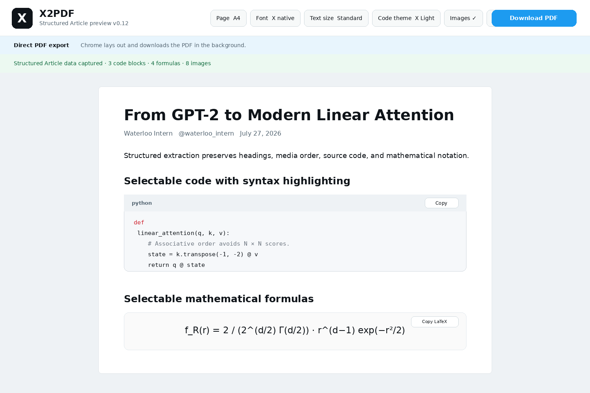
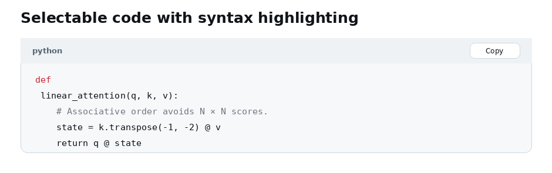
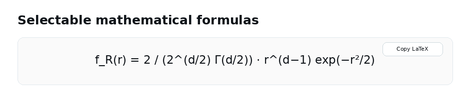
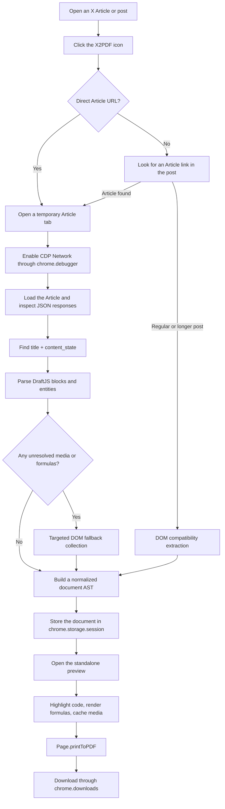

# X2PDF

<p align="center">
  <strong>Export X Articles and long-form posts as clean, structured, searchable PDFs.</strong>
</p>

<p align="center">
  <a href="README.md">English</a> ·
  <a href="README.zh-CN.md">简体中文</a>
</p>

<p align="center">
  <a href="https://github.com/troicc/X2PDF/actions/workflows/ci.yml"></a>
  <a href="https://github.com/troicc/X2PDF/releases"></a>
  
  
  <a href="LICENSE"></a>
</p>

X2PDF is a local-first Chrome / Edge extension for exporting **X Articles, longer posts, and regular posts** to PDF.

It does not simply screenshot the page or send the live X interface to the browser print dialog. For X Articles, it first attempts to capture the structured Article payload already loaded by the page, reconstructs the document from DraftJS blocks and entities, and then renders a dedicated reading view with headings, lists, quotes, source code, mathematical formulas, and media.

> [!IMPORTANT]
> X2PDF is not affiliated with, endorsed by, or sponsored by X Corp. Copyright and reuse rights for exported content remain subject to the original author, the applicable content license, and local law.

<p align="center">
  
</p>

<p align="center">
  <a href="https://github.com/troicc/X2PDF/releases/latest"><strong>Download the latest release</strong></a> ·
  <a href="#installation">Install from source</a> ·
  <a href="README.zh-CN.md">中文说明</a>
</p>

## Table of contents

- [Highlights](#highlights)
- [Supported content](#supported-content)
- [Screenshots](#screenshots)
- [Installation](#installation)
- [Usage](#usage)
- [How it works](#how-it-works)
- [Why an Article tab may scroll automatically](#why-an-article-tab-may-scroll-automatically)
- [Preview and export options](#preview-and-export-options)
- [Code blocks](#code-blocks)
- [Mathematical formulas](#mathematical-formulas)
- [PDF generation](#pdf-generation)
- [Permissions and privacy](#permissions-and-privacy)
- [Project structure](#project-structure)
- [Development](#development)
- [Testing](#testing)
- [Publishing and releases](#publishing-and-releases)
- [Diagnostics and bug reports](#diagnostics-and-bug-reports)
- [Known limitations](#known-limitations)
- [Roadmap](#roadmap)
- [Contributing](#contributing)
- [FAQ](#faq)
- [Third-party components](#third-party-components)
- [License](#license)

## Highlights

### Structured X Article extraction

- Captures the structured Article JSON that the X page has already requested whenever possible.
- Reconstructs the original order from DraftJS `content_state.blocks` and `entityMap`.
- Uses `article.title` as the verified title instead of guessing from the first large text node.
- Keeps DOM extraction as a compatibility fallback for regular posts, longer posts, and incomplete Article entities.

### Rich-text preservation

- Article title and multiple heading levels
- Paragraphs
- Bold, italic, underline, and strikethrough
- Inline code
- Superscript and subscript
- Ordered, unordered, and nested lists
- Block quotes
- Horizontal separators
- Tables
- Link cards and embedded posts
- Images, video thumbnails, and GIF thumbnails

### Source code

- Restores real code text from Markdown entities in X Articles.
- Preserves indentation, line breaks, comments, and special characters.
- Uses locally bundled PrismJS syntax highlighting; no runtime code is loaded from a CDN.
- Provides a **Copy** button for every code block.
- Keeps code selectable and copyable in the generated PDF.

### Mathematical formulas

- Recognizes `LATEX`, `TEX`, `MATH`, and `EQUATION` entities.
- Resolves formula sources through `entityKey` references when the current entity contains only an identifier.
- Falls back to rendered MathML, MathJax, KaTeX annotations, and accessibility attributes when the Article payload is incomplete.
- Uses native Chromium MathML by default, making most formulas selectable and searchable in the PDF.
- Falls back to SVG for an individual formula only when native MathML is unsuitable.
- Provides a **Copy LaTeX** button in the preview.

### Direct PDF export

- Generates and downloads the PDF directly without opening the system print dialog.
- Supports A4 and Letter page sizes.
- Preserves backgrounds, syntax highlighting, images, formulas, and links.
- Enables tagged PDF output and a document outline where Chromium supports them.
- Caches X media before printing to reduce missing-image failures.

### Reading and print customization

- X-style Chirp font option
- Serif reading option
- System sans-serif option
- Three body-text sizes
- X Light, GitHub Light, One Dark, and plain code themes
- Toggles for images, embeds, source information, and code wrapping
- Preferences saved locally in the browser

## Supported content

| Content type | Typical URL / source | Extraction path | Status |
|---|---|---|---|
| X Article | `x.com/user/article/123...` | Captured Article JSON + DraftJS parser | Primary supported format |
| Post linking to an Article | `x.com/user/status/123...` | Resolve Article URL, then parse the Article | Supported |
| Longer Post | `x.com/user/status/123...` | DOM compatibility extractor | Supported, less stable than Articles |
| Regular Post | `x.com/user/status/123...` | DOM compatibility extractor | Supported |
| Nested lists | DraftJS blocks | Rebuilt from block type and `depth` | Supported |
| Markdown code | Atomic entity | Parsed into a structured code block | Supported |
| LaTeX formula | Formula entity | Native MathML with SVG fallback | Supported |
| Images | Media entity / DOM fallback | Inserted in document order and cached | Supported |
| Video / GIF | Media entity | Thumbnail plus source link | Partial |
| Polls, cards, embedded posts | Entity / page data | Structured card when data is available | Best effort |
| Private, deleted, or restricted content | Any | Only content visible to the current browser session | No access-control bypass |

## Screenshots

<table>
<tr>
<td width="50%"></td>
<td width="50%"></td>
</tr>
<tr>
<td align="center"><strong>Selectable, highlighted code</strong></td>
<td align="center"><strong>Native MathML with LaTeX copying</strong></td>
</tr>
</table>

The screenshots are repository-maintained mockups based on the actual preview styles. Exported results depend on the source Article and the selected layout options.

## Installation

X2PDF is currently distributed as an unpacked Manifest V3 extension.

### Option 1: download a release

Open <https://github.com/troicc/X2PDF/releases/latest>, download `X2PDF-v0.12.0.zip`, and extract it. Release ZIPs contain only the extension runtime files.

### Option 2: clone the repository

```bash
git clone https://github.com/troicc/X2PDF.git
cd X2PDF
```

### Option 3: download the source ZIP

Open the repository page, select **Code → Download ZIP**, and extract it locally.

### Load it in Chrome

1. Open `chrome://extensions/`.
2. Enable **Developer mode**.
3. Select **Load unpacked**.
4. Choose the repository directory that directly contains `manifest.json`.

### Load it in Microsoft Edge

1. Open `edge://extensions/`.
2. Enable **Developer mode**.
3. Select **Load unpacked**.
4. Choose the repository directory that directly contains `manifest.json`.

### Browser requirements

- Chrome 109 or newer
- Chromium 109 or newer
- Chromium-based Microsoft Edge 109 or newer

The minimum version is mainly required for the native MathML rendering path.

### Updating an unpacked installation

1. Pull or replace the local files.
2. Open the browser extension management page.
3. Click **Reload** on the X2PDF card.
4. Close old preview tabs and export the Article again.

## Usage

1. Sign in to X and open an Article or post detail page.
2. Wait until the page has substantially loaded.
3. Click the X2PDF extension icon.
4. X2PDF extracts the content and opens a dedicated preview tab.
5. Verify the title, media, code blocks, and formulas.
6. Adjust the page size, font, text size, and code theme.
7. Click **Download PDF**.
8. The file is written to the browser's default download location.

### Editable title

The document title in the preview is editable. The edited value is used for:

- the PDF title shown on the first page;
- the downloaded filename.

Editing it does not modify the original X Article.

## How it works



### 1. Capturing the Article payload

Before navigating the temporary Article tab, the extension enables the Chrome DevTools Protocol Network domain. It inspects JSON responses already received by the X page and recursively looks for a candidate containing:

```text
title
content_state.blocks
content_state.entityMap or content_state.entities
```

The detector does not rely on a single hard-coded GraphQL operation name or hash.

### 2. DraftJS parsing

The structured parser converts X's DraftJS representation into a platform-independent internal document model:

```text
paragraph
heading
blockquote
list
code
formula
image
media
embedded_post
link_card
table
separator
```

The preview and PDF renderer consume this normalized model rather than the live X DOM.

### 3. Compatibility fallback

If the structured payload contains an unresolved formula reference or missing media data, X2PDF inspects the rendered page for the missing item. DOM extraction is also used for regular and longer posts that do not expose an Article `content_state`.

### 4. Preview and export

The normalized document is transferred through `chrome.storage.session`. The preview page then applies typography, PrismJS highlighting, MathML rendering, media caching, and print CSS before calling Chromium's PDF engine.

## Why an Article tab may scroll automatically

X uses lazy loading and virtualized rendering for long content:

- images may not load until they are near the viewport;
- formulas can be mounted by a delayed component;
- media far away from the viewport may be unmounted;
- loading media can change the total Article height.

When structured Article data still contains unresolved formulas or media, X2PDF performs a fallback scan of the rendered page. The current fallback can make several top-to-bottom passes and stops when the collected result becomes stable.

The scrolling is used only to read content. X2PDF does **not** use it to:

- like or repost content;
- reply to a post;
- follow an account;
- edit or publish content;
- change account settings.

## Preview and export options

| Option | Values | Purpose |
|---|---|---|
| Page size | A4 / Letter | Controls the PDF paper size |
| Font | X native / Serif / System sans-serif | Controls body and heading typography |
| Text size | Compact / Standard / Relaxed | Controls reading density |
| Code theme | X Light / GitHub Light / One Dark / Plain | Controls syntax colors |
| Images | On / Off | Includes or hides images |
| Embedded content | On / Off | Includes or hides post embeds and cards |
| Wrap code | On / Off | Wraps long code lines |
| Source | On / Off | Adds the original URL and capture time |
| Copy diagnostics | — | Copies extraction and rendering diagnostics |
| Download PDF | — | Generates and downloads the PDF directly |

Preferences are stored in `chrome.storage.local` and restored in later previews.

### Font presets

#### X native (Chirp)

- Attempts to load Chirp at runtime from `abs.twimg.com`.
- Does not bundle or redistribute Chirp font files.
- Falls back to the system sans-serif stack if loading fails.
- Uses available system fonts for CJK characters.

#### Serif reading

Uses a fallback stack including Georgia, Noto Serif, and platform serif fonts for a book-like print appearance.

#### System sans-serif

Uses the operating system's UI font stack and provides the broadest compatibility.

> [!NOTE]
> The extension interface follows the browser UI language and currently includes English and Simplified Chinese. English is the fallback locale.

## Code blocks

### Extraction source

Code in an X Article is often stored inside the Markdown field of a DraftJS atomic entity rather than rendered as a native `<pre>` element. X2PDF parses fenced code such as:

````markdown
```python
def forward(x):
    return x ** 2
```
````

and converts it to a structured block:

```json
{
  "type": "code",
  "language": "python",
  "text": "def forward(x):\n    return x ** 2"
}
```

### Highlighted languages

Bundled PrismJS components currently cover:

- Python
- JavaScript, TypeScript, JSX, and TSX
- HTML / XML and CSS
- JSON, YAML, and Markdown
- Bash, PowerShell, and Dockerfile
- SQL
- C, C++, C#, and Objective-C
- Java, Kotlin, Scala, and Swift
- Go and Rust
- Ruby, R, and MATLAB
- Diff

When no language label exists, X2PDF uses conservative language detection. If the result is uncertain, the block remains plain text.

### Copying code

Each code block includes a **Copy** button that:

- copies the original code string, not PrismJS-generated HTML;
- preserves indentation and line breaks;
- first uses the Clipboard API;
- falls back to a hidden `textarea` when asynchronous clipboard access is denied;
- is automatically hidden in the generated PDF.

## Mathematical formulas

### Formula recovery order

1. Read direct fields such as `latex`, `tex`, `formula`, `equation`, or `mathml`.
2. Resolve `entityKey` references against captured JSON responses.
3. When the backend payload remains incomplete, inspect:
   - native `<math>` elements;
   - KaTeX `annotation[encoding="application/x-tex"]`;
   - MathJax containers;
   - `data-latex`, `data-tex`, and related attributes;
   - accessibility labels and formula alternative text.
4. Reinsert formulas according to the original DraftJS atomic-block order.

### Formula normalization

Accessibility text can contain Unicode mathematical letters or malformed commands, for example:

```text
\boldsymbol𝑆
\boldsymbol𝑥
\mathcal N
```

X2PDF normalizes common cases into valid TeX such as:

```text
\mathbf{S}
\mathbf{x}
\mathcal{N}
```

It also collapses duplicate TeX sources discovered in multiple accessibility layers.

### Rendering path

```text
LaTeX
  ↓
MathJax TeX → MathML conversion
  ↓
Native Chromium MathML
  ↓
Selectable and searchable mathematical text in the PDF
```

If a particular expression cannot be rendered reliably through native MathML, only that expression falls back to SVG. SVG remains visually sharp but its glyphs are vector paths rather than selectable text.

### Copying formulas

Every formula in the preview includes **Copy LaTeX**. Selecting a formula in the PDF normally copies Unicode mathematical text, not the original TeX source; use the preview button when exact LaTeX is required.

## PDF generation

When **Download PDF** is pressed, X2PDF:

1. downloads allowed remote media and converts it to Data URLs;
2. waits for images to decode;
3. waits for the selected fonts;
4. applies PrismJS highlighting;
5. converts formulas to MathML;
6. waits for formula, font, and image layout to stabilize;
7. invokes `Page.printToPDF` through the Chrome DevTools Protocol;
8. converts the returned Base64 PDF into a Blob;
9. saves it through `chrome.downloads.download`.

The print stylesheet automatically hides:

- the preview toolbar;
- code-copy buttons;
- LaTeX-copy buttons;
- diagnostic and status messages.

## Permissions and privacy

### Permission reference

| Permission / host | Why it is required |
|---|---|
| `activeTab` | Accesses the current page only after the user clicks the extension |
| `scripting` | Runs extraction and fallback collection scripts |
| `storage` | Temporarily stores the document and saves display preferences |
| `debugger` | Captures Article JSON responses and invokes `Page.printToPDF` |
| `downloads` | Saves the generated PDF |
| `x.com` / `twitter.com` | Reads the page explicitly selected for export |
| `pbs.twimg.com` | Downloads and caches Article media |
| `abs.twimg.com` | Attempts to load Chirp when the X-native font preset is selected |

### Privacy model

The standalone privacy statement is available in [PRIVACY.md](PRIVACY.md).


- No `cookies` permission
- No upload of X cookies or authentication tokens
- No external processing backend
- Article parsing, preview rendering, and PDF generation happen in the local browser
- Temporary Article tabs are closed after extraction
- Pending preview data is stored in `chrome.storage.session`
- Display preferences are stored in `chrome.storage.local`
- Media caching accepts only selected HTTPS paths on `pbs.twimg.com`

### About the `debugger` warning

Chrome displays a prominent warning for extensions requesting `debugger`. X2PDF uses it for two narrowly defined operations:

1. inspecting JSON responses already received by the temporary Article tab;
2. invoking Chromium's built-in `Page.printToPDF` command.

It is not used to publish posts, interact with accounts, or bypass X access controls.

## Project structure

```text
X2PDF/
├── manifest.json               # Manifest V3 metadata and permissions
├── background.js               # Entry point, network capture, temporary tabs, PDF download
├── extractor.js                # DOM compatibility extraction and fallback scanning
├── structured-parser.js        # Article, DraftJS, Markdown, entity, and media parser
├── preview.html                # Standalone preview page
├── preview.css                 # Screen and print layout, fonts, code themes
├── preview.js                  # Rendering, preferences, media hydration, export control
├── code-highlighter.js         # PrismJS language normalization and highlighting
├── formula-renderer.js         # TeX → MathML conversion and SVG fallback
├── mathjax-config.js           # Local MathJax configuration
├── clipboard-utils.js          # Code, LaTeX, and diagnostic copy helpers
├── icons/                      # Extension icons
├── vendor/
│   ├── prism/                  # Locally bundled PrismJS and language components
│   └── mathjax/                # Locally bundled MathJax files
├── tests/                      # Node, browser, and PDF regression tests
├── CHANGELOG.md
├── THIRD_PARTY_NOTICES.md
├── LICENSE
├── README.md                   # English documentation
└── README.zh-CN.md             # Simplified Chinese documentation
```

## Development

The project uses plain JavaScript, HTML, and CSS. There is no required build step: edit the files and reload the unpacked extension.

### Recommended environment

- Chrome, Chromium, or Edge 109+
- Node.js 20+ for portable tests and repository validation
- Python 3.10+ for the PDF regression test
- Python 3 for packaging and the optional PDF regression test
- Playwright and Poppler `pdftotext` only for the optional PDF text-layer regression


Install development dependencies and run the portable suite:

```bash
npm install
npm test
```

There is no runtime build step. After editing extension files, reload the unpacked extension from `chrome://extensions/`.

### Parser responsibilities

- Structured Article semantics: `structured-parser.js`
- DOM and dynamic-page fallback: `extractor.js`
- Network capture and temporary-tab orchestration: `background.js`
- Preview block rendering: `preview.js`

When adding a new content type, prefer extending the normalized document model and `renderBlock()` rather than passing X DOM nodes directly into the preview.

### Version updates

For a release, review at least:

- `manifest.json` → `version` and, when necessary, `description`
- version text in `preview.html`
- extractor version values in diagnostics
- `README.md` and `README.zh-CN.md`
- `CHANGELOG.md`

### Packaging

```bash
npm run package
```

The packaging script validates the runtime file list and creates `dist/X2PDF-v0.12.0.zip`. The archive excludes tests, repository-only documentation, generated assets, and development dependencies. Attach this ZIP to a GitHub Release instead of committing it to the source tree.

## Testing

Install the declared development dependencies and run the complete portable suite:

```bash
npm install
npm test
```

This performs:

- manifest, localization, file-reference, and forbidden-font checks;
- JavaScript syntax checks;
- DraftJS, Markdown, media, formula, clipboard, and code-copy unit tests;
- PrismJS highlighting tests;
- MathJax conversion tests.

Build the distributable extension after the tests:

```bash
npm run release:check
```

Optional visual and PDF regression fixtures remain under `tests/`. `tests/native-mathml-pdf.test.py` additionally requires Chromium, Python Playwright, and `pdftotext`.

GitHub Actions runs the portable tests and uploads a packaged ZIP for every push to `main`, pull request, and manual workflow run.

## Publishing and releases

Repository publication is documented in [PUBLISHING.md](PUBLISHING.md). With GitHub CLI authenticated, the maintainer can test, package, push, update repository metadata/topics, create the release, and upload the ZIP with:

```bash
./scripts/publish-release.sh 0.12.0
```

Release notes for this version are stored in [`docs/releases/v0.12.0.md`](docs/releases/v0.12.0.md). Upload [`docs/images/social-preview.png`](docs/images/social-preview.png) in the GitHub repository settings as the social preview image.

## Diagnostics and bug reports

The preview includes **Copy diagnostics**. The output contains:

- acquisition method: captured response or DOM fallback;
- Article candidate path;
- verified title source;
- DraftJS block and entity counts;
- Markdown, media, formula, and unknown-entity counts;
- normalized output block counts;
- unresolved media and formulas;
- syntax-highlighting language statistics;
- formula renderer and selectability statistics;
- font-loading status;
- current layout preferences.

Diagnostics do not intentionally include cookies. Still, review the copied JSON before posting it publicly.

### Suggested bug report

````markdown
## X URL
https://x.com/...

## Problem
- [ ] Incorrect title
- [ ] Missing or malformed code
- [ ] Missing or malformed formula
- [ ] Missing or misordered image
- [ ] PDF download failure
- [ ] Layout problem

## Environment
- X2PDF version:
- Chrome / Edge version:
- Operating system:

## Diagnostics
```json
Paste the result of “Copy diagnostics” here.
```

## Screenshots or PDF
Mention the affected page and the expected result.
````

Open an issue at: <https://github.com/troicc/X2PDF/issues>

## Known limitations

1. **X can change its frontend or payload structure.**  
   X2PDF avoids fixed CSS classes and fixed GraphQL hashes where possible, but new DOM and entity variants may still require updates.

2. **Some formula entities contain only a reference key.**  
   These Articles require rendered-page fallback collection and can take longer to process.

3. **SVG fallback formulas are not selectable character by character.**  
   Native MathML remains the default; SVG is used only for incompatible expressions.

4. **Video and GIF content is not embedded as animation.**  
   X2PDF exports a thumbnail and source link.

5. **Regular posts and Longer Posts are less stable than Articles.**  
   They rely more heavily on the live X DOM.

6. **Restricted content remains restricted.**  
   X2PDF processes only content available to the current browser session and does not bypass login, subscription, deletion, or account restrictions.

7. **Chirp is not bundled.**  
   The X-native preset loads it at runtime and falls back to system fonts if unavailable.

8. **Copied PDF math is not guaranteed to reproduce the original LaTeX.**  
   Use **Copy LaTeX** in the preview for an exact source string.

9. **Very long code lines involve a layout tradeoff.**  
   Wrapping prevents horizontal clipping but changes the visual line count.


## Roadmap

- [ ] Replace repeated full-page formula scans with targeted missing-entity collection
- [ ] Merge same-author posts into complete threads
- [ ] Export Markdown
- [ ] Export EPUB
- [ ] Add a generated table of contents and internal PDF navigation
- [ ] Improve table pagination
- [ ] Add custom margins and code-font sizing
- [ ] Add batch export for bookmarks or saved items
- [x] Add portable npm-based tests and GitHub Actions CI
- [x] Add English / Chinese UI localization
- [ ] Prepare and review a Chrome Web Store submission
- [ ] Evaluate Firefox compatibility

## Contributing

Issues and pull requests are welcome. Read [CONTRIBUTING.md](CONTRIBUTING.md), the [Code of Conduct](CODE_OF_CONDUCT.md), and the [Security policy](SECURITY.md) before submitting substantial changes.

Please follow these principles:

1. Prefer structured Article data; use DOM extraction only as fallback.
2. Do not read or upload user cookies.
3. Do not introduce runtime remote JavaScript.
4. Include a diagnostic sample for new X DOM or entity variants.
5. Add regression coverage for formula, code, or print-layout changes.
6. Do not commit restricted font files.
7. Update the changelog and documentation when behavior changes.

A useful pull request description includes:

- the affected X URL or a minimized fixture;
- the root cause;
- before / after behavior;
- test instructions;
- any new permissions or network access;
- privacy implications;
- documentation and changelog updates.

## FAQ

### Why does X2PDF open a temporary Article tab?

The extension needs to enable network inspection before navigation so it can capture the structured Article response. The temporary tab is closed after extraction.

### Why does the Article scroll from top to bottom?

Only incomplete formula or media entities trigger rendered-page fallback collection. The extension may scan the page several times until the result stabilizes.

### Does X2PDF read my X cookies?

No. The manifest does not request the `cookies` permission, and X2PDF does not upload cookies or authentication tokens.

### Why does Chrome say the extension can debug the browser?

That is the standard warning for `debugger`. X2PDF uses the permission to inspect Article JSON responses and invoke `Page.printToPDF`.

### Why are some formulas selectable while others are not?

Native MathML formulas are selectable. An expression that falls back to SVG is rendered as vector paths and cannot be selected character by character.

### Why is copied math not LaTeX?

A PDF contains positioned mathematical text, not the original TeX source. Use **Copy LaTeX** in the preview.

### Why can the X-native font fall back to another font?

Chirp is not redistributed with the extension. Network failure, permission changes, or changes to X's static font URLs can trigger the system-font fallback.

### Why not use the normal browser print command?

Printing the live page can include navigation, action buttons, recommendations, dynamic widgets, and unstable pagination. It also cannot reliably reconstruct DraftJS code and formula entities.

### Is a backend server required?

No. Extraction, parsing, preview rendering, and PDF generation run locally in the browser.

## Third-party components

### PrismJS 1.30.0

Used for local syntax highlighting under the MIT License.

### MathJax 3.2.1

Used for TeX-to-MathML conversion and SVG compatibility fallback under the Apache License 2.0.

See:

- [`THIRD_PARTY_NOTICES.md`](THIRD_PARTY_NOTICES.md)
- [`vendor/prism/LICENSE`](vendor/prism/LICENSE)
- [`vendor/mathjax/LICENSE`](vendor/mathjax/LICENSE)

X2PDF does not include or redistribute Chirp font files.

## License

X2PDF is released under the [MIT License](LICENSE).

When redistributing the project, retain the license and third-party notices.
